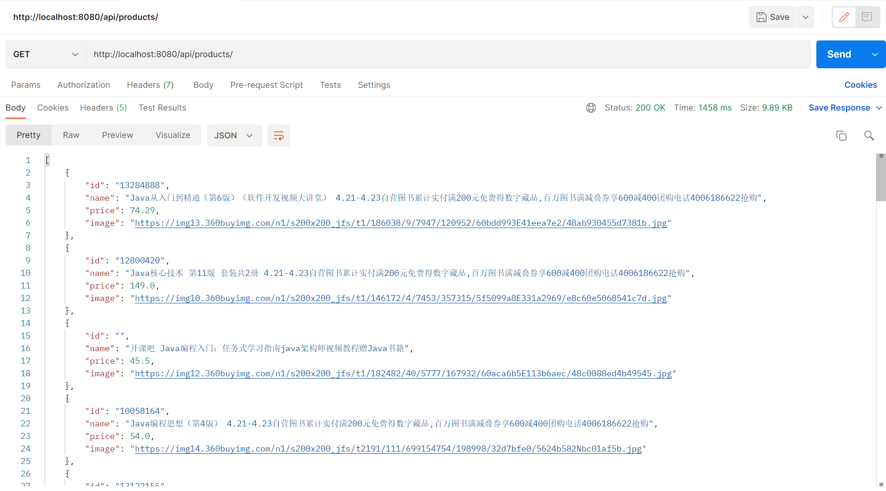
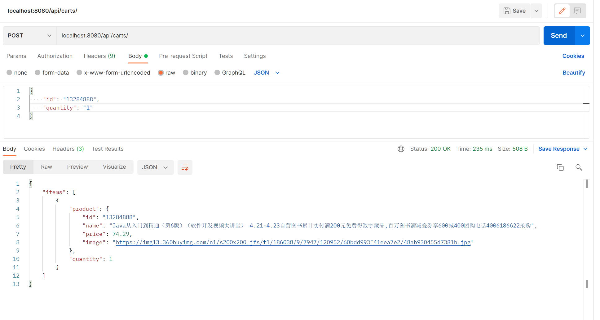
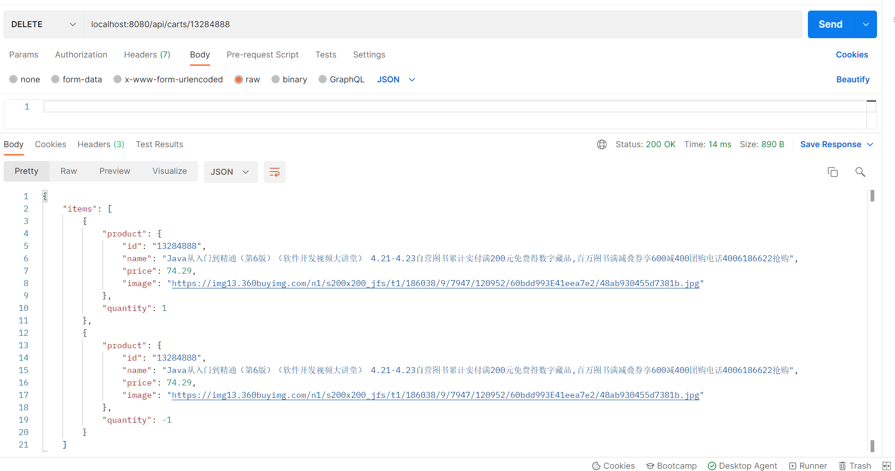

# RESTful microPoS 

请参考spring-petclinic-rest/spring-petclinic-microserivces 将aw04的webpos项目改为rest风格的微服务架构
（至少包含产品管理服务pos-products和购物车管理服务pos-carts以及discovery/gateway等微服务架构下需要的基础设施服务）。具体要求包括：

1. 请使用OpenAPI的定义每个服务的rest接口（参考pos-products）
2. 请使用ehcache管理缓存；
3. 请注意使用断路器等机制；
4. 有兴趣的同学可自学一些reactjs或vuejs等为microPoS开发一个前端。

**获取商品**

**添加商品**

**删除商品（直观体现**

